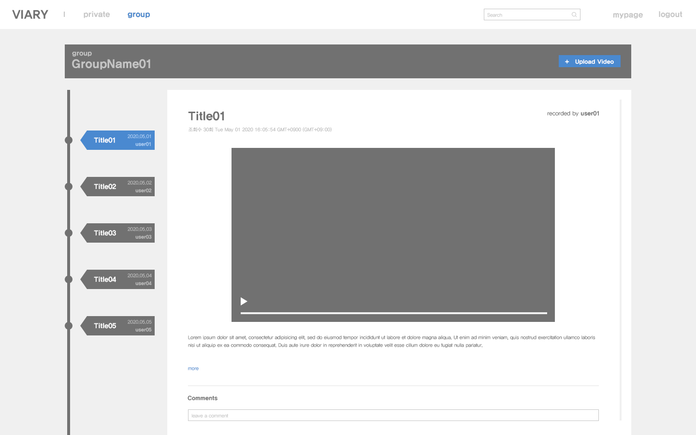

# 웹설

## [nodeJS](https://nodejs.org/en/)랑 [몽고DB](https://www.mongodb.com/download-center/community) 까셔야 합니다!!!

까신 뒤

```bash
node -v  => 노드JS
mongod   => 몽고DB
```

를 터미널에 입력해서 잘 깔렸는지 확인해봅시당

<br>

설치

```bash
git clone https://github.com/seows2/wotube

cd wotube

npm install

```

서버를 키기 위해서 터미널에서 `npm run dev:server` 입력해주세요.  
css 작업을 하기 위해서는 또 다른 터미널에서 `npm run dev:assets` 또한 입력해주세요.  
vscode와 크롬을 통한 개발을 추천드립니다.  
기본 PORT는 4000번이나 PORT 번호 바꿔야 하시는 분은 .env파일에서 PORT를 바꾸시거나 init.js 파일에서

```js
const PORT = 원하는 포트;
```

해당 부분을 변경해주세영

<br>

## **해당 프로젝트를 돌리려면 .env파일이 필요합니다. 저에게 요청해주세요** 

<br>

   
- [ ] 헤더  
  - [ ] 폰트 및 색깔 변경
  - [x] Active 또는 hover시 색 변경
  - [x] 그리드 위치 수정
- [ ] 동영상 페이지 프론트
- [ ] 로그인, 회원가입 모달창 프론트
- [ ] 업로드 프론트
- [ ] DB설계
- [ ] Back 로직 설계
- [ ] 구현